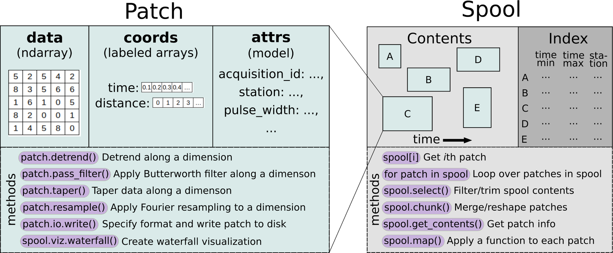
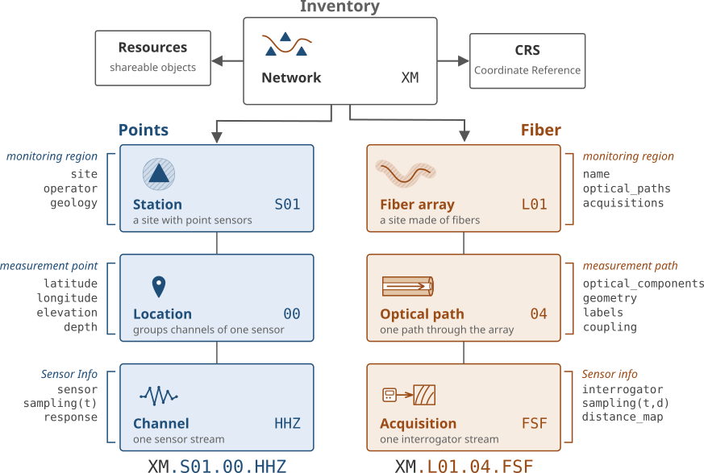

## Acknowledgements

::::{.fragment}
DASCore Contributors:

:::{.center-text}
<!-- Snapshot of https://contrib.rocks/image?repo=DASDAE/dascore, vendored so the
slide does not depend on the conference network. Refresh it before the talk. -->
{.nostretch fig-align="center" width="80%" fig-alt="The people who have contributed to DASCore."}
:::
::::

::::{.fragment}
As well as:

:::{.center-text}
 [INERIS](https://www.ineris.fr), [NIOSH](https://www.cdc.gov/niosh), [NSF (grant 2148614)](https://www.nsf.gov/awardsearch/show-award/?AWD_ID=2148614), [Colorado School of Mines](https://www.mines.edu) and [University College Dublin](https://www.ucd.ie)
:::
::::

## The problem {.smaller}

DAS data are awkward **long** before they are interesting

::: {.tight}
::: {.incremental}
- There are many different data formats
- Managing large file archives is a pain
- Simple processing functions are often not simple to write
- Tracking and integrating metadata is challenging
- A large amount of duplication in the ecosystem
:::
:::

## What DASCore gives you {.smaller}

**Accelerates the science** by providing a solid base:

::: {.incremental}
- IO support for many DFOS formats
- Archive management
- Common processing and visualization routines
- Support for units
- A description of the observing system
- Extensible plugin architecture
:::

## `Patch` and `Spool`

{fig-align="center" width="88%" fig-alt="A Patch holds data, coords and attrs, and is one entry in a Spool's contents and index; both expose their own methods."}

::: {.notes}
The `Patch` is the unit of work; the `Spool` helps you manage patches
:::

## `Inventory` {.smaller}

:::: {.columns}

::: {.column width="52%"}

:::

::: {.column width="48%" .dense}

The inventory describes the **observing system**

:::{.incremental}
- What fiber was measured, and where it was
- Which interrogator settings produced which recordings
- All of it a function of time, supporting epochs
:::

:::{.fragment}
Attaches to a spool for expressive querying and patch enrichment
:::

:::

::::

## Learning objectives {.smaller}

:::{.tight}
:::{.incremental}
1. **Use `Patch`**: filter, smooth, transform and plot (notebook 01)

2. **Manage an archive with `Spool`**: subselect regions of interest, chunk, merge, reshape and visualize contents (notebook 02)

3. **Track a deployment with `Inventory`**: attach metadata and enrich selection and patches (notebook 03)

4. **Bonus**: create high-performance CPU/GPU kernels with DASJax (notebook 04)
:::
:::

## The dataset {.smaller}

A complex fiber-optic network at an underground hardrock mine

<iframe class="geometry-frame" data-geometry-src="galileo_2026/data/docs/geometry.html" width="1216" height="425" title="Borehole geometry against the existing cavity and the planned extraction volume"></iframe>

::: {.center-text .smallest}
Open it [on its own](galileo_2026/data/docs/geometry.html){target="_blank"}, or see the optical paths in [optical_topo.pdf](galileo_2026/data/docs/optical_topo.pdf){target="_blank"}
:::

## Getting started {.smaller}
 

::: {.center-text}
**[github.com/DASDAE/galileo_2026](https://github.com/DASDAE/galileo_2026#setup)**
:::
